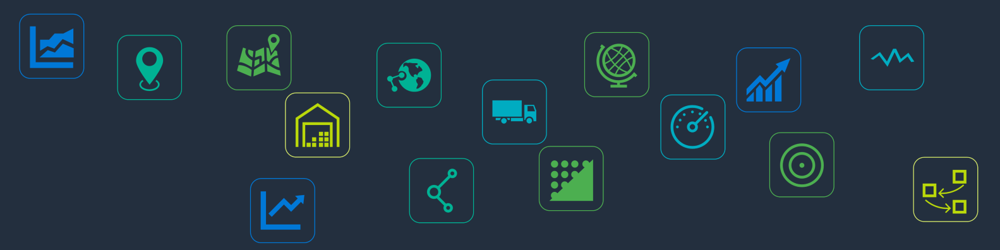

<p align="center">
  
</p>


# Log-hub Python API library

[](https://pypi.org/project/pyloghub/)

## Table of Contents
- [Introduction](#introduction)
- [Prerequisites](#prerequisites)
- [Installation](#installation)
  - [Setting Up Python Environment](#setting-up-python-environment)
  - [Installing `pyloghub` Package](#installing-pyloghub-package)
- [Configuration](#configuration)
- [Usage](#usage)
- [Available Functionalities](#available-functionalities)
- [Contact Us](#contact-us)
- [License](#license)

## Introduction

The `pyloghub` package provides convinient access to various Log-hub API services for Supply Chain Visualization, Network Design Optimization, and Transport Optimization.

### Prerequisites

- Python 3.10 or later recommended
- Pip (Python package manager)
- Log-hub API key
- Supply Chain APPS PRO subscription

## Installation

### Setting Up Python Environment

#### Recommended Python Version

Python 3.10 or later is recommended for optimal performance and compatibility.

#### Optional: Setting Up a Virtual Environment

A virtual environment allows you to manage Python packages for different projects separately.

1. **Create a Virtual Environment**:
   - **Windows**: 
     ```bash
     python -m venv loghub_env
     ```
   - **macOS/Linux**: 
     ```bash
     python3 -m venv loghub_env
     ```

2. **Activate the Virtual Environment**:
   - **Windows**: 
     ```bash
     .\loghub_env\Scripts\activate
     ```
   - **macOS/Linux**: 
     ```bash
     source loghub_env/bin/activate
     ```

   Deactivate with `deactivate` when done.

### Installing `pyloghub` Package

Within the environment, install the package using:

```bash
pip install pyloghub
```

## Configuration

### Obtaining an API Key

1. Sign up or log in at [Log-hub Account Integration](https://production.supply-chain-apps.log-hub.com/sca/account/integration).
2. Obtain your API key.

### Setting Up Your Environment

Securely store your API key for use in your Python scripts or as an environment variable.

## Usage

### Sample Code: Reverse Distance Calculation

This example demonstrates using the Reverse Distance Calculation feature:

1. **Import Functions**:
   ```python
   from pyloghub.distance_calculation import reverse_distance_calculation, reverse_distance_calculation_sample_data
   ```

2. **Load Sample Data**:
   ```python
   sample_data = reverse_distance_calculation_sample_data()
   geocode_data_df = sample_data['geocode_data']
   parameters = sample_data['parameters']
   ```

3. **Perform Calculation**:
   ```python
   reverse_distance_result_df = reverse_distance_calculation(geocode_data_df, parameters, 'YOUR_API_KEY')
   ```

   Replace `'YOUR_API_KEY'` with your actual Log-hub API key.

4. **View Results**:
   ```python
   print(reverse_distance_result_df)
   ```

## Available Functionalities

### Overview

`pyloghub` offers a suite of functionalities to enhance your supply chain management processes. Below is a quick guide to the available features and sample usage for each.

### Geocoding
#### Forward Geocoding
Convert addresses to geographic coordinates.

```python
from pyloghub.geocoding import forward_geocoding, forward_geocoding_sample_data

sample_data = forward_geocoding_sample_data()
addresses_df = sample_data['addresses']
forward_geocoding_result_df = forward_geocoding(addresses_df, api_key)
```

#### Reverse Geocoding
Convert geographic coordinates to addresses.

```python
from pyloghub.geocoding import reverse_geocoding, reverse_geocoding_sample_data

sample_data = reverse_geocoding_sample_data()
geocodes_df = sample_data['geocodes']
reverse_geocoding_result_df = reverse_geocoding(geocodes_df, api_key)
```

### Distance Calculation
#### Forward Distance Calculation
Calculate distances based on address data.

```python
from pyloghub.distance_calculation import forward_distance_calculation, forward_distance_calculation_sample_data

sample_data = forward_distance_calculation_sample_data()
address_data_df = sample_data['address_data']
parameters = sample_data['parameters']
forward_distance_calculation_result_df = forward_distance_calculation(address_data_df, parameters, api_key)
```

#### Reverse Distance Calculation
Calculate distances based on geocode data.

```python
from pyloghub.distance_calculation import reverse_distance_calculation, reverse_distance_calculation_sample_data

sample_data = reverse_distance_calculation_sample_data()
geocode_data_df = sample_data['geocode_data']
parameters = sample_data['parameters']
reverse_center_of_gravity_result_df = reverse_distance_calculation(geocode_data_df, parameters, api_key)
```

### Center of Gravity
#### Forward Center of Gravity
Determine optimal facility locations based on addresses.

```python
from pyloghub.center_of_gravity import forward_center_of_gravity, forward_center_of_gravity_sample_data

sample_data = forward_center_of_gravity_sample_data()
addresses_df = sample_data['addresses']
parameters = sample_data['parameters']
assigned_addresses_df, centers_df = forward_center_of_gravity(addresses_df, parameters, api_key)
```

#### Reverse Center of Gravity
Determine optimal facility locations based on coordinates.

```python
from pyloghub.center_of_gravity import reverse_center_of_gravity, reverse_center_of_gravity_sample_data

sample_data = reverse_center_of_gravity_sample_data()
coordinates_df = sample_data['coordinates']
parameters = sample_data['parameters']
assigned_geocodes_df, centers_df = reverse_center_of_gravity(coordinates_df, parameters, api_key)
```

### Transport Optimization
#### Milkrun Optimization Plus
Optimize delivery routes with multiple stops.

```python
from pyloghub.milkrun_optimization_plus import forward_milkrun_optimization_plus, forward_milkrun_optimization_plus_sample_data

sample_data = forward_milkrun_optimization_plus_sample_data()
depots_df = sample_data['depots']
vehicles_df = sample_data['vehicles']
jobs_df = sample_data['jobs']
timeWindowProfiles_df = sample_data['timeWindowProfiles']
breaks_df = sample_data['breaks']
parameters = sample_data['parameters']

route_overview_df, route_details_df, external_orders_df  = forward_milkrun_optimization_plus(depots_df, vehicles_df, jobs_df, timeWindowProfiles_df, breaks_df, parameters, api_key)
```

#### Transport Optimization Plus
Optimize transport routes for shipments.

```python
from pyloghub.transport_optimization_plus import forward_transport_optimization_plus, forward_transport_optimization_plus_sample_data

sample_data = forward_transport_optimization_plus_sample_data()
vehicles_df = sample_data['vehicles']
shipments_df = sample_data['shipments']
timeWindowProfiles_df = sample_data['timeWindowProfiles']
breaks_df = sample_data['breaks']
parameters = sample_data['parameters']

route_overview_df, route_details_df, external_orders_df = forward_transport_optimization_plus(vehicles_df, shipments_df, timeWindowProfiles_df, breaks_df, parameters, api_key)
```

#### Shipment Analyzer
Analyze and optimize shipment costs and operations.

```python
from pyloghub.shipment_analyzer import forward_shipment_analyzer, forward_shipment_analyzer_sample_data

sample_data = forward_shipment_analyzer_sample_data()
shipments_df = sample_data['shipments']
transport_costs_adjustments_df = sample_data['transportCostAdjustments']
consolidation_df = sample_data['consolidation']
surcharges_df = sample_data['surcharges']
parameters = sample_data['parameters']

shipments_analysis_df, transports_analysis_df = forward_shipment_analyzer(shipments_df, transport_costs_adjustments_df, consolidation_df, surcharges_df, parameters, api_key)
```

For the Milkrun Optimization, Transport Optimization as well as the Shipment Analyzer service there is also the reverse version available.

## Contact Us

For any inquiries, assistance, or additional information, feel free to reach out to us at our office or via email.

**Address:**  
Schwandweg 5,  
8834 Schindellegi,  
Switzerland  

**Email:**  
[support@log-hub.com](mailto:support@log-hub.com)

Alternatively, for more information and resources, visit [Log-hub API Documentation](https://production.supply-chain-apps.log-hub.com/sca/api-docs).


## License

Distributed under the [MIT License](https://opensource.org/licenses/MIT).
